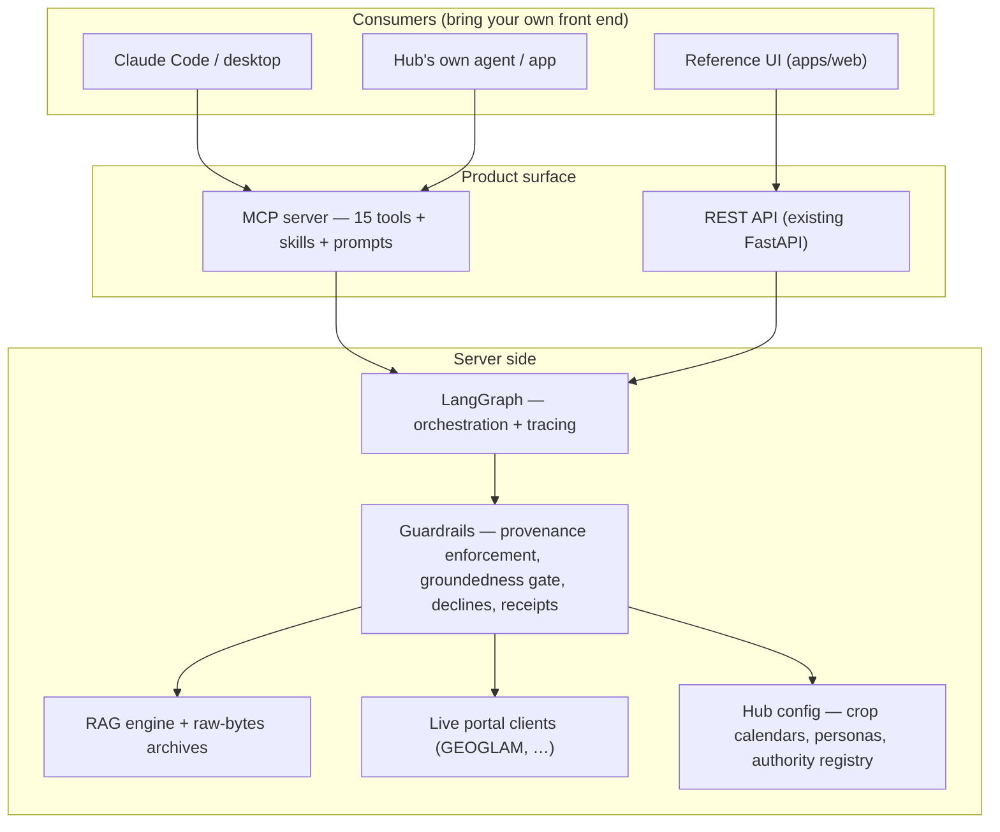

# Global Risk Platform — MCP architecture proposal (v0.1)

> **Superseded by `ARCHITECTURE.md` (v0.2, 2026-07-19)** — kept as the record of what was
> presented at the 2026-07-14 call. v0.2 rebuilds this from scratch around the eight bones,
> the seven-rule contract, Domain Packs, and the precedent research.

**Status:** draft for discussion — a starting point, expected to be wrong in places.
**Date:** 2026-07-14
**In one line:** ship the platform as a set of connectable tools, widgets, and a reference agent, so hubs build *with* it instead of just using our app.

---

## 1. The idea, in plain words

Until now we built a finished app per domain. The product-requirements (PRD) discussion reframed who our real users are: **the hubs and technical partners are builders**; ministries and analysts are the people who use what the hubs build. Builders don't want our front end — they want our capabilities inside *their* front end, *their* Claude, *their* workflow.

An **MCP server** (MCP = Model Context Protocol, the open standard for connecting tools to AI assistants) is the standard way to deliver that. Nothing exotic: it's a service that exposes our functions as "tools" an AI assistant can call — as put on the PRD call, *"we're just doing API design here — deciding what functionality to expose and what to hide."* Connect Claude to it and Claude can search our document library, pull live crop conditions, write a fully cited brief — or help someone build their own app that does all of that.

What makes our server worth connecting to is not the search or the data — anyone can wire up document search feeding an AI model (the technique is called RAG, retrieval-augmented generation, and "RAG is RAG"). It's the **honesty layer**: answers arrive with their sources attached, missing data is declared, unverifiable claims are blocked, and every answer can be replayed to show exactly where it came from. In this design that layer lives **inside every tool**, so it survives no matter whose front end sits on top.

The best evidence that builders want this came from the crop-monitor lead, months before we had the vocabulary for it:

> "One of the people we're training from Tanzania… had county-level data on his own. He adjusted our workflow and produced his report at the county level **without our input**. For him, he left with: *ooh, I can do this on my own, with my own data, without having to send it over to some god*" — i.e., without a distant central gatekeeper.

---

## 2. Three ways to plug in

Different hubs have different capacity. The same backend serves all three levels — nobody is forced to take more than they need.

| Level | Who it's for | What they get |
|---|---|---|
| **1. Tools only** | Hubs with their own developers, AI model (LLM), or agent; anyone using Claude Code (Anthropic's developer app) | The MCP server: tools + skills + prompts + embeddable widgets. They orchestrate. |
| **2. Agent included** | Hubs who want answers, not plumbing | Our reference agent behind an API — it plans the steps, calls the tools, manages the session (including human-in-the-loop moments), and hands back a governed answer. Also reachable as the composite tools `foodsecurity.brief` and `risk.assess`. |
| **3. Reference UI** | Hubs with no front-end team; demos; training | Our web app, generic-branded with placeholder slots — plus each of its trust components available as widgets, so they can take pieces. |

One backend, reachable two ways: the **REST API** is the web backend that already exists (what our own app calls today, and what hubs with front-end teams can call directly, with documentation); the **MCP server** exposes the *same functions* to AI assistants. We do not build a new backend for this.

---

## 3. What the hubs actually asked for (receipts)

Every element of this design traces to a recorded ask. Roles only; quotes verbatim from call transcripts.

| Ask (who) | Quote | What we do about it |
|---|---|---|
| A boundary on sources (crop-monitor lead) | "In the world of GPTs there needs to be a **boundary as to where information comes from**." | Documents can't enter the library without source, date, and validation status; every answer links back to an archived copy of its sources. |
| The misuse fear (crop-monitor lead) | "Somebody will **copy that summary with everybody's logos** and put it on the internet, and **it will be wrong**." | The fact-check gate can *stop* an answer from going out — it isn't just a warning — and it's offered as a standalone tool: anyone can run *any* text through it, including their own chatbot's. |
| Honest limits (crop-monitor lead) | "It **explains what's missing, how wrong it might be**, and how to consider that in my decision-making." | "We don't know" and "this data is missing" are part of the answer payload, not UI decoration. |
| Adjustable crop calendar (ministry, via crop-monitor lead) | "The ministry asked quite specifically for the ability to **adjust the crop calendar**… and it **shows up in the output**." | The calendar is a tool with a human-override input; adjusted output is labeled ADJUSTED; the calendar editor ships as an embeddable widget. |
| Local data, adjusted estimates (crop-monitor lead) | "If you had field-scale information and you trust it on your end… get **an adjusted estimate**." | Human input as a first-class tool argument (calendar now, more local overrides later). |
| Bring-your-own everything (program lead) | "What's stopping us from just going the MCP route and I connect my Claude to our ecosystem?" | Level 1 exists: tools only, bring your own LLM, agent, and front end. |
| Widget demo (program lead) | "I want to connect my Claude and **use the crop-calendar widget**." | The UI tool family (§6) + the two-week demo (§9). |
| Tool count (program lead) | "Maybe **10–20 tools** that do these specific things." | 15 tools, 14 in the first release. New widgets become catalog entries, not new tools, so the count holds. |
| Design schema + embeddable UI (this team) | "Just like we'll be **exposing the design schema through the MCP server**, we can expose these widgets… they can import these widgets… suddenly they have their own sub-app running in their own front end." | The three UI tiers: design tokens → copy-in components → hosted widgets (§6). |
| Provider independence (software lead + AI engineer) | "Something **platform-independent** would be better"; local models should fit. | Provider-layer decision in §8 — and Level-1 consumers bring their own LLM anyway. |
| Observability (AI engineer) | Tool calls must be traceable; hubs develop against the traces. | Every tool call is recorded; hubs use those records to debug and build their own apps, via the receipt tool. |
| Source authority (land-cover hub lead) | "If it is pulling from everywhere and giving answers… completely different at the national scale… **we lose the credibility and trust in our platform**." | Every dataset carries an authority label (nationally-recognized vs global-fallback); a fallback is flagged, never silent. Adopted into the core now — land cover itself stays light (§7). |

---

## 4. Five rules every tool follows

This is the honesty layer, stated as a contract. Every tool on the server obeys all five.

1. **Every answer carries its evidence.** Sources, dates, validation status, relevance scores, archived copies, staleness flags — attached to the payload, not added by a UI.
2. **Every "no" says why.** No corpus, no match above the relevance floor, stale feed, out of scope — a decline is a structured answer, not an error.
3. **Every answer can be replayed.** A receipt records what was asked, which tools ran with which literal queries, what came back, what was cited, and what was dropped.
4. **Human adjustments are honored and labeled.** An adjusted crop calendar is used, cited as ADJUSTED, and pinned to the country/crop it was made for. A mismatched adjustment is dropped — and the drop is declared.
5. **"Verified" only comes from the server.** No UI element we ship can be told to display a green tick. Positive verification states render only from a server-checked receipt; the default state is "unverified."

---

## 5. The tools — all fifteen, one place

**How we decided what becomes a tool:** something gets its own tool only if a consumer can check its output on its own, or if it captures a human judgment. Whole pipelines stay as single "do the whole thing" tools. (So: document search is a tool; the embedding math inside it is not. The full brief-writer is a tool; its internal steps are not.) Future widgets and components are added as **catalog entries served by the existing tools — never as new tools** — so the surface stays small.

Status: ✅ exists today as working code behind the current API · ◐ partly exists — needs the listed finishing work · 🔨 to build · **v1.5** second wave.

### Discover

| # | Tool | What it does | Guardrail built in | Status |
|---|---|---|---|---|
| 1 | `platform.capabilities` | Lists what's on the server: domains, document collections, datasets, calendars, widgets, skills. | Datasets carry authority + freshness labels; the list includes what we *don't* have. | 🔨 trivial |

### The document library

| # | Tool | What it does | Guardrail built in | Status |
|---|---|---|---|---|
| 2 | `corpus.search` | Searches a named document collection; returns passages with relevance scores, source details, and archived-copy links. | Declines when nothing clears the relevance floor — and names the cause. | ✅ |
| 3 | `corpus.ingest` | Adds a document to a collection. | **Refuses** any document without source, publication date, and validation status; archives the original bytes. | ✅ |
| 4 | `corpus.documents` | Lists everything in a collection, with provenance. | — | ✅ |
| 5 | `corpus.document` | Fetches the archived original of any document. | The end of every trace-back: the actual file we read. | ✅ |

### Verification

| # | Tool | What it does | Guardrail built in | Status |
|---|---|---|---|---|
| 6 | `verify.groundedness` | Runs any draft text against an evidence pack through our fact-gate: do the citations resolve, is every paragraph sourced, do the figures match the evidence. Returns pass/fail per check, plus a saved `report_id`. | The gate as a service — usable on text *we never wrote*, e.g. a hub's own chatbot output. The `report_id` lets a genuine QA badge be embedded (§6). | ✅ core; needs an input adapter + report persistence |
| 7 | `trace.receipt` | Replays a past answer: the question, the tools that ran, the literal queries, the results, the citations, the declines. | Observability for every consumer, not just us. | ◐ receipts exist per-answer; needs storage by id |

### Live data

| # | Tool | What it does | Guardrail built in | Status |
|---|---|---|---|---|
| 8 | `cropmonitor.conditions` | Live crop conditions from GEOGLAM for a country/crop/month. | Staleness flagged; a cached last-good value is declared as such. | ✅ |
| 9 | `calendar.get` | The hub-default crop calendar for a country/crop, with an optional human override. | Overrides are cited as ADJUSTED and pinned to their target; a mismatch is dropped and declared (rule 4). | ✅ |

### Full answers

| # | Tool | What it does | Guardrail built in | Status |
|---|---|---|---|---|
| 10 | `foodsecurity.brief` | Question in, governed brief out: gathers evidence (search + live conditions + calendar), writes a four-section cited brief, runs the fact-gate on it. | The whole pipeline behind one call; declines honestly; returns the evidence and gate report alongside the text. | ✅ |
| 11 | `risk.assess` | The existing global-risk flood computation, as a tool. | Refactored to obey the five rules — this absorbs the known backend bug list, so we refactor once, not twice. | ◐ exists behind the current chat route; needs the contract refactor |

### UI

| # | Tool | What it does | Guardrail built in | Status |
|---|---|---|---|---|
| 12 | `ui.design` | The platform's look as data: design tokens — the named colors, fonts, and spacing values that define our look — as JSON, as CSS variables (light and dark), and as a Tailwind/daisyUI theme; plus the writing conventions (decline wording, "requester-adjusted vs hub-default" phrasing). One call: "make this look like the platform family." | The honesty conventions ship inside the theme: the success color is reserved for server-verified states; check-chips are pass/fail/not-run, never defaulting to pass; machine-readable rules included (e.g. `verified_requires_receipt_link: true`). | 🔨 gated on a 2–3 day theme-authoring slice (§6) |
| 13 | `ui.catalog` | Lists the available widgets and components in plain language, with what each needs to render. | Each entry declares its trust class (§6) and what it refuses to render without. | 🔨 trivial |
| 14 | `ui.embed` | Returns a ready-to-paste embed for a hosted widget: the crop-calendar editor, the insight-provenance graph. | The embed URL is **signed and expiring**; trust widgets fetch their state from the server by answer id — there is no "show a green tick" input. Unresolvable id → refusal. `sample: true` → watermarked SAMPLE render. | 🔨 medium (widget routes + decoupling + CORS) |
| 15 | `ui.component` | Copy-in recipes for the small trust pieces (source card, validation badge, QA strip, decline card, ADJUSTED badge): plain HTML + CSS on the design tokens, with a data contract and version stamp. | The QA-strip recipe requires a receipt link; recipes are versioned "eject packs" — copied code gets no updates, and the catalog shows when a copy is behind. | **v1.5** — after the widget decoupling |

Shipped alongside the tools (not tools themselves): **skills and prompts** — worked guides like "compose a food-security outlook with these tools" and "build a front end that embeds our widgets," plus the persona/guardrail prompt set (the "UI as a skill" idea from the call). This is what makes the train-the-trainer story concrete.

---

## 6. The UI tools, one level deeper

Builders who ask an AI assistant to write their app for them ("vibe coding") need UI at three depths, and each gets a different delivery shape. The rule: **small inline pieces are copied in; anything stateful or trust-bearing stays hosted by us.** The catalog marks which is which, so the consuming LLM can't pick the wrong shape.

**Tier 1 — the look (`ui.design`).** One call returns the design language in the three formats a builder might need (JSON to reason over, CSS variables that work in any stack in light and dark, a Tailwind/daisyUI theme for the common one) — with the honesty rules riding along as machine-readable data, so a vibe-coded UI inherits *unverified-by-default* even on screens we never shipped. Honest cost: this theme **doesn't exist yet** — the reference UI currently runs framework defaults with some colors hardcoded in components. So the first slice (~2–3 days) is authoring the theme and making the reference UI import the same file the tool serves. Single source; the "family look" can't drift.

**Tier 2 — copy-in components (`ui.component`, v1.5).** Source cards, badges, QA strips, decline cards — pieces that must sit inline with the consumer's own content. Delivered as plain HTML + CSS recipes rather than our React source, because our source only renders inside our build, and an LLM converts a concrete HTML example into any framework faithfully. They're **eject packs**: versioned, but unsupported once copied.

**Tier 3 — hosted widgets (`ui.embed`).** The two big interactive surfaces, each answering a recorded ask:
- **Crop-calendar editor** — the ministry ask. It emits the human judgment to the host page, and the host passes it into its own `foodsecurity.brief` call; the widget never decides its own ADJUSTED label — the server does.
- **Insight-provenance graph** — the full path from question to claims: parse → literal queries → passages inside documents → the fact-gate → claims, with hover-tracing. The strongest visual counter to the raw-chatbot anti-pattern shown on the food-systems call. It accepts **only an answer id** and draws its state from the server's receipt — it cannot be fed invented claims.

Mechanics, staged: first release = embedded pages (iframes) with signed, expiring URLs — the work of decoupling these components from our app's internals is the same work the copy-in recipes need later, so none of it is throwaway. Native web components come at v1.5, when a real consumer asks.

**Trust classes.** Every catalog entry is one of three:

| Class | Examples | Rule |
|---|---|---|
| Presentational | colors, typography, page furniture | Style freely |
| Input | calendar editor | Captures a human judgment; never renders its own verdict |
| Receipt-bound | QA strip, source cards, provenance graph, decline card | Fail-closed: defaults to "unverified"; positive states only from a server-resolved id; nothing can suppress a decline, a gap, or an ADJUSTED label |

**Making forgery pointless.** CSS is copyable; no design stops someone hand-painting a green tick. Instead we make the honest path cheaper and the fake path checkable:
- Run your text through `verify.groundedness` and you get a *genuine* QA badge in one call — the would-be counterfeiter becomes a customer of the gate.
- Every verified state we render carries a public receipt link stating *what* was verified. The published convention: **a verification mark without a resolvable receipt link is not ours.** One click exposes a fake — the same logic as the archived-copy link on every source.
- Builders get watermarked SAMPLE embeds and seeded demo ids, so development never needs a faked "pass."

**How a builder discovers any of this.** Three channels: answers themselves carry render hints ("there's a widget that can draw this"), the catalog is written in the builder's own vocabulary ("visualize my RAG insights"), and the skills include worked examples.

---

## 7. What we are deliberately NOT building

Named here so they're decisions, not accidents.

- **Land-cover data generation** (satellite embeddings, foundation models, GPU pipelines). A legitimate line of work and the land-cover hub's stated priority — but it's capability-building for the hub, not a platform tool: expert-gated, co-developed, compute-bound, and explicitly not for public users ("we don't want to give this facility to the public"). If the hub's pipeline matures, a gated job-submission tool (`landcover.generate_job`) can be added later.
- **Land cover as a domain pack at all, for now.** That conversation is still refining. What we adopt today is the transferable lesson — dataset authority labels — into the core. A thin `landcover.stats` tool over the hub's existing national time series is a natural future pack; sketched, not committed.
- **Derived land-cover analytics** (fragmentation, corridors, carbon accounting) — future composites; they need a proven base data tool first.
- **Climate-scenario outlooks** (the standard "SSP" scenario pathways used in climate modeling) — modeling work, not retrieval; an honest "we don't do this" in the capabilities list.
- **Natural-language UI control** ("switch to night mode") — parked on the call as not the low-hanging fruit.
- **Multi-turn session management at Level 1** — that's the consumer's agent's job; we ship it at Level 2.
- **Low-level search plumbing as tools** (the machinery inside document search, e.g. the embedding step). Raised on the call as the fully-granular end state; deferred — its output isn't checkable on its own (the §5 rule), and it would mean owning bring-your-own-vector-store complexity.
- **The UI refuse-list:**
  - no trust component that takes a verdict as an input, in any packaging;
  - no option to hide declines, gaps, honest zeros, or ADJUSTED labels;
  - no partner-logo packs in the design tokens — only a neutral "built with these tools" mark that carries a receipt link;
  - no maintained versions for other frameworks and no supported pre-packaged code library — copy-in recipes are versioned but unsupported once copied, and no pixel-parity guarantee for the copies;
  - theming may restyle everything *except* the verdict colors and the receipt link.

---

## 8. Under the hood (technical)

**LangGraph stays server-side, behind the tools**, doing two jobs: orchestrating the composite tools (`foodsecurity.brief`, `risk.assess` — multi-step flows with failure points deserve explicit graphs), and tracing every tool call. Consumers see the traces through `trace.receipt`; hubs debugging their own compositions need exactly that. Level-1 consumers who bring their own agent skip our orchestration but still get traced tools — the instrumentation sits below the tool boundary.

**Provider layer.** MCP makes Level 1 provider-agnostic by construction — consumers bring their own LLM. The choice only affects what *we* run (the Level-2 agent and embeddings). Current state: one OpenAI-compatible client registry; known pain: an SDK-compat seam broke on newer Gemini models. Options: (A) keep the registry, add a native adapter per problem provider — least churn; (B) move provider interaction to LangChain — better LangGraph integration, but its own version churn. Recommendation: **decide inside the refactor** — trial a LangChain adapter *behind* the existing registry interface so it's swappable, and gate the decision on testing the big three (Anthropic, Gemini, OpenAI) plus **Ollama** (the local-model ask, and the most stable target).

---

## 9. The demo, and the two-week path to it

The demo we agreed matters: *open Claude Code, connect the server, ask a question, trust the answer, then build something.*

1. `claude mcp add grp -- <server cmd>` — one line.
2. *"A strong El Niño is developing — what should I expect for maize in Zambia?"* → Claude calls `foodsecurity.brief` → a cited brief with its gate report, in the terminal.
3. *"Why should I trust the second paragraph?"* → Claude calls `trace.receipt` and `corpus.document` → the literal queries that ran, and the archived source PDF.
4. *"Build me a page that shows this brief with the provenance graph, in the platform's look."* → Claude pulls `ui.design` tokens, scaffolds a page, embeds the live provenance graph — then the calendar round trip: edit the calendar in the widget, re-ask, and the new brief cites the adjustment as ADJUSTED.

**Week 1 — expose what already exists, and prove it from Claude Code.** Mount the functions that already exist as MCP tools — eight complete, two partial (see the status column in §5) — add `platform.capabilities` and `ui.catalog`, and store receipts and gate reports by id. *(Tech: FastMCP mounted alongside the existing FastAPI — same process, same functions.)* In parallel: the theme-authoring slice (~2–3 days).
**Week 2 — make the two widgets embeddable in outside pages, and rehearse.** The calendar editor and provenance graph get their embed routes with signed, expiring URLs (~3–4 days — the components must first be decoupled from our app's internal state, plus cross-origin access); first skills and prompts; demo dry-run. In parallel: start the `risk.assess` refactor.

**Honest risks:** receipt storage is new; the widget routes need real decoupling work before any embed ships (the calendar currently writes to app state that won't exist in a host page); the risk-graph refactor is the least-scoped item — keep it off the demo's critical path. Copy-in components (`ui.component`) are explicitly second-wave.

---

## 10. Decisions needed on this call

1. **The tool rule and the count (§5)** — accept 15 tools (14 first release), growing by catalog entries rather than new tools?
2. **Provider layer (§8)** — how our own agent talks to the different AI providers: two engineering options, detailed in §8; we propose deciding during the refactor. Who owns the trial?
3. **Hosting** — the server runs locally on the demo machine for now; a shared hosted server comes later (tech: stdio now, streamable-HTTP hosted). Who hosts it, and with what login/auth? (Can be deferred past the first demo, which runs local.)
4. **The demo script and the two-week target (§9)** — agree it.
5. **Refactor sequencing** — confirm the global-risk backend cleanup (known bug list: only the first tool call executes, missing error handling, naming, routing redundancy) lands *inside* the `risk.assess` MCP work, not as a separate pass.
6. **UI trust classes and the refuse-list (§6, §7)** — accept fail-closed rendering (no verdict-as-input, ever) as policy? This constrains what we'll build for hubs, so it should be a team decision, not an engineering default.

---

## 11. Questions for the hubs

- Per use case: **what do you plan to build, and with what technical capacity** — developers building a product, or analysts connecting Claude? This decides which level we polish first and which skills we write.
- Food security: bless the corpus scope and the hub-default crop calendars (standing ask).
- Land cover: when ready — which dataset is the nationally-recognized one per country, and which statistics matter first. No platform commitment until then.
